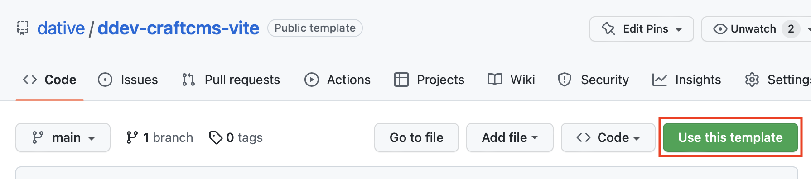

# ddev-craftcms-vite

This repository is a template for [DDEV](https://ddev.readthedocs.io/en/stable/) + [CraftCMS](https://craftcms.com/docs/4.x/) + [Vite](https://vitejs.dev) project for local development.

You can create a new repo from this one by clicking the template button in the top right corner of the page.

## Components of the repository

- The base setup to run CraftCMS + Vite with DDEV
- Github actions setup for building an deploying the site in Forge.

## Requirements

DDEV installed and running on your machine. [Installation instructions](https://ddev.readthedocs.io/en/stable/#installation)

## Getting started

After cloning your new repo:

1. Create the new template repository by using the template button.
2. Clone the new repository to your local machine.
3. Replace `<craft-vite>` in `.ddev/confi.yaml` with your local project name.
4. Start DDEV with `ddev start`.
5. Run `ddev install-craft` to install CraftCMS.

## DDEV & Craft Setup

DDEV is configured with the following settings:

- PHP 8.1
- MySQL 8.0
- Node 16

## Usage

Once installed you can run `ddev yarn dev` to start the dev server.

### Craft Setup:

The following Craft CMS plugins are used on this site:

- [Mailgun](https://github.com/craftcms/mailgun)
- [Redactor](https://github.com/craftcms/redactor)
- [BlurHash](https://github.com/dodecastudio/craft-blurhash)
- [Vite](https://github.com/nystudio107/craft-vite)
- [Empty Coalesce](https://github.com/nystudio107/craft-emptycoalesce)
- [Retour](https://github.com/nystudio107/craft-retour)
- [SEOmatic](https://github.com/nystudio107/craft-seomatic)
- [Typogrify](https://github.com/nystudio107/craft-typogrify)
- [Minify](https://github.com/nystudio107/craft-minify)
- [Relax](https://github.com/ostark/craft-relax)
- [Typed Link Field](https://github.com/sebastian-lenz/craft-linkfield)
- [DigitalOcean Spaces Volume](https://github.com/vaersaagod/dospaces)
- [Navigation](https://github.com/verbb/navigation)
- [Super Table](https://github.com/verbb/super-table)

### Frontend Setup:

The frontend is configured using [Vite](https://vitejs.dev), with Typescript, and [TailwindCSS](https://tailwindcss.com/).

## Thanks

Big thanks to Andrew Welch for his awesome [plugins](https://nystudio107.com/plugins) and [articles](https://nystudio107.com/blog) from which this repository is heavily based on.

## Roadmap

Brought to you by [Dative](https://hellodative.com)